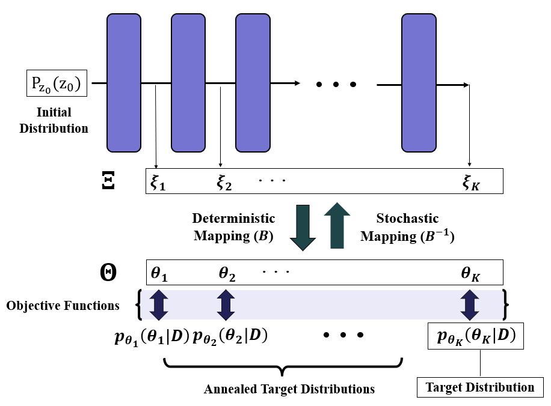

# Annealed and Transformed Variational Inference 

> Official code for [Fast Computer Model Calibration using Annealed and Transformed Variational Inference]



ATVI adopts surjective function and temperature annealing to avoid inferential challenges in a naive VI approach in calibration tasks. 

This code relies on the NF model package from the SurVAE library.  To start with, you must install the SurVAE library. 

#### Installation

In the folder containing `setup.py`, run
```
pip install .
```

### Experiments
To train or evaluate model, please check /experiments.

### Paper 

The original paper can be found here: 
*https://www.tandfonline.com/doi/full/10.1080/10618600.2024.2374962

#### Acknowledgements

I would like to thank the authors who provide useful repositories. Mainly, 

* https://github.com/didriknielsen/survae_flows
* https://github.com/rtqichen/torchdiffeq

